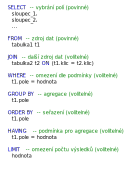

# Dotazování na data

Pro jednodušší datové sety uložené v základních formátech (TXT, CSV, XLS, ...) obecně platí, že jejich prohlížení a úpravy lze provádět v základních programech (uvedeno v [sekci inicializace/software](../1_inicializace/B_software.ipynb)). U složitějších datových setů (více než 1 tabulka) pak používáme k dotazování jednu z následujících metod extrakce dat:

- SQL
- Python
- R
- další jazyky sloužící k získání dat


## SQL (Structured Query Language)

Jazyk SQL slouží k dotazování na data uložená ve strukturované podobě především v relačních databázových systémech (RDBMS).
Pomocí SQL lze dokonce měnit strukturu dat i data samotná. SQL se skládá z několika klíčových slov, které byly standartizovány na konci 80. let.

Obecná struktura výběrového dotazu je následující:



Pro úpravu dat v jazyce SQL se používá následující struktura:


```python

```

```python

```
