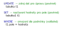

<!-- #region -->
## Získání dat pomocí SQL 

[←](3A_dotazy.md)

Jazyk SQL (Structured Query Language) se skládá z několika klíčových slov, které byly standartizovány na konci 80. let. 
Slouží k dotazování a změně strukturovaných dat uložených především v relačních databázových systémech (RDBMS). 
Pomocí SQL lze dokonce měnit strukturu dat i data samotná. SQL 

### Výběrové dotazy

Obecná struktura výběrového dotazu je následující:

K efektivnímu zobrazování složitějších dotazů nám pomáhá řada operátorů, klauzulí a hodnot. Jejich přehled uvádí následující tabulka::

[Zdroj](https://www.codecademy.com/learn/learn-sql/modules/learn-sql-queries/cheatsheet)

| Typ    | Název       | Popis       | Příklad     | 
|--------| ----------- | ----------- | ----------- | 
| operátor | `AND`    | spojování podmínek ve **WHERE** klauzuli   |  `SELECT A FROM T1 WHERE A.x='1' AND A.y=1`  |
| operátor | `OR`    | kombinace podmínek ve **WHERE** klauzuli   |  `SELECT A FROM T1 WHERE A.x='1' OR A.y=1`  |
| operátor | `LIKE`    | definice podobných výrazů **WHERE** klauzuli   |  `SELECT A FROM T1 WHERE A.x LIKE 'ab%'` |
| operátor | `AND`    | spojování podmínek ve **WHERE** klauzuli   |  `SELECT A FROM T1 WHERE A.x='1' AND A.y=1`  |
| operátor | `OR`    | kombinace podmínek ve **WHERE** klauzuli   |  `SELECT A FROM T1 WHERE A.x='1' OR A.y=1`  |
| operátor | `LIKE`    | definice podobných výrazů **WHERE** klauzuli   |  `SELECT A FROM T1 WHERE A.x LIKE 'ab%'` |

### Změnové dotazy

Pro úpravu dat v jazyce SQL se používá následující struktura:

<!-- #endregion -->

<!-- #region -->
--------
Poznámky:

1 - kompletnější výčet jazyků na dotazování se lze dočíst na [wikipedii](https://en.wikipedia.org/wiki/Query_language).
2 -[learn SQL manipulation](https://www.codecademy.com/learn/learn-sql/modules/learn-sql-manipulation/cheatsheet).
<!-- #endregion -->
