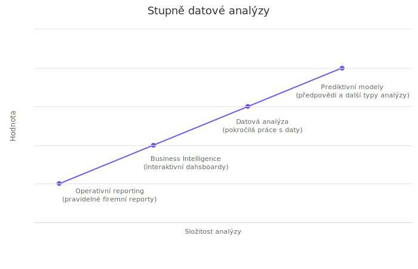

<!-- #region -->
# Analýza dat

[←](../Readme.md)

Jedná se o oblast aktivit, které slouží k využití zpracovaných dat s cílem odhalit související informace a podpořit proces rozhodování. 

V posledním bode analýzy dat...

V této části

https://en.wikipedia.org/wiki/Data_analysis

 ## Grafické zobrazení dat
 
 -   Kvantitativní

	-   Koláčový graf
	-   Histogram
	-   Bodový diagram

-   Kvantitativní

	-   Sloupcový graf
	-   Paretův graf
	-   Teplotní mapa
 
<!-- #endregion -->

--------
Poznámky:

1 - téma integrace dat vydá na separátní informační balík, nyní viz [wikipedia](https://en.wikipedia.org/wiki/Data_integration)
